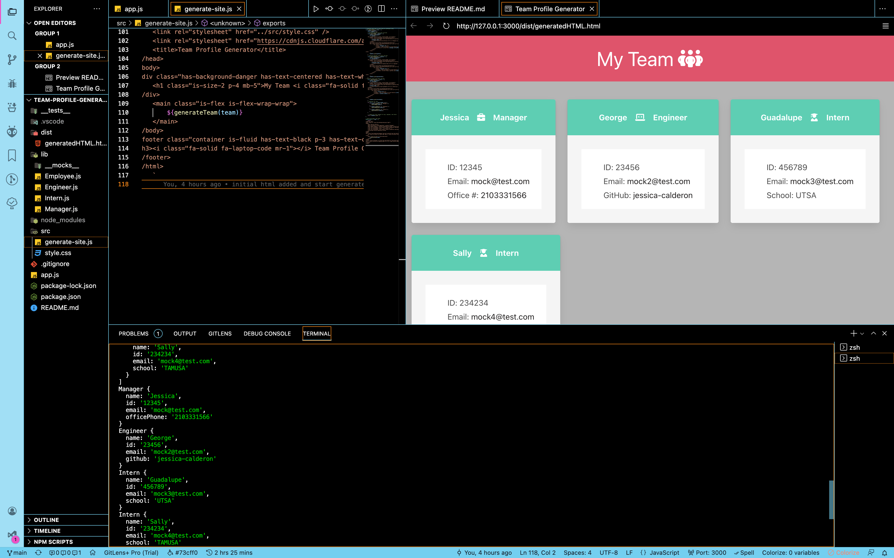

# Team Profile Generator
## Table-of-Contents
* [Description](#description)
* [Built With](#languages)
* [Installation](#installation)
* [Contributing](#contributing)
* [Usage](#usage)
* [Testing](#tests)
* [Questions](#questions)
* [Application Preview](#application-preview)

       

## [Description](#table-of-contents)
A CIL application that allows managers to generate team rosters for employees, engineers, and interns.

## [Languages](#table-of-contents)
HTML, Bulma/CSS, Javascript, Node.js, Inquirer

      
      

## [Usage](#table-of-contents)
Clone code repository and run 'node index' in root folder terminal

## [Testing](#table-of-contents)
Jest: 'npm run test'

## [Contributing](#table-of-contents)

Thank you for your interest in contributing to this project, however, I am currently not accepting third party contributions.
      

## [Installation](#table-of-contents)
Visit: https://github.com/jessica-calderon/team-profile-generator

## [Questions](#table-of-contents)
Questions? Please contact me at the following links:  
[GitHub](https://github.com/jessica-calderon)  
[Email: calderonjessica13@yahoo.com](mailto:calderonjessica13@yahoo.com)

## [Application Preview](#table-of-contents)
Click the image to see a video preview of the application and Jest npm tests.

